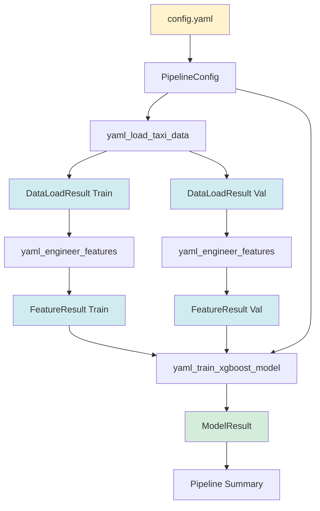

# 🚕 NYC Taxi Duration Pipeline - YAML Config Version

## 📋 Descripción

Pipeline de Machine Learning para predecir la duración de viajes de taxi en NYC usando **Prefect** para orquestación y **MLflow** para tracking. Esta versión utiliza configuración YAML y artifacts estructurados entre tasks.

## ✨ Características Principales

- ✅ **Configuración YAML** - Todos los parámetros en `config.yaml`
- ✅ **Artifacts Estructurados** - Dataclasses tipadas entre tasks
- ✅ **Type Safety** - Autocomplete y validación de tipos
- ✅ **Nombres Únicos** - Fácil identificación en Prefect UI
- ✅ **Reutilizable** - Mismo código, diferentes configs

## 📁 Archivos

```
prefect-with-yml/
├── config.yaml                    # ⭐ Configuración centralizada
├── taxi_pipeline_yaml_config.py   # ⭐ Pipeline principal
└── README.md                      # Esta guía
```

## 🎯 Nombres en Prefect UI

### Flow
**Nombre**: `🚕 Taxi Duration ML Pipeline (YAML-Config)`  
**Run Name**: `taxi-yaml-{year}-{month}`

### Tasks

1. **📥 YAML-Config: Load Taxi Data**
   - Descarga datos de NYC Taxi
   - Aplica feature engineering básico
   - Filtra outliers según config
   - Genera artifact con estadísticas

2. **🔧 YAML-Config: Engineer Features**
   - Crea matriz de features con DictVectorizer
   - Codifica ubicaciones categóricas
   - Incluye features numéricas
   - Genera artifact con info de features

3. **🤖 YAML-Config: Train XGBoost Model**
   - Entrena modelo XGBoost
   - Registra en MLflow
   - Guarda preprocessor
   - Genera artifacts de performance

### Artifacts Generados

- `yaml-data-summary-{year}-{month}` - Estadísticas de datos
- `yaml-feature-info-{year}-{month}` - Información de features
- `yaml-model-performance` - Métricas del modelo
- `yaml-training-summary` - Resumen detallado (Markdown)
- `yaml-pipeline-summary` - Resumen completo del pipeline

## 🚀 Inicio Rápido

### Paso 1: Verificar dependencias

```bash
# Asegúrate de estar en el directorio correcto
cd /Users/mdurango/Downloads/proyectos/machine-learning-udm/04-orchestration/prefect-with-yml

# Verificar que pyyaml esté instalado
python -c "import yaml; print('✅ PyYAML instalado')"
```

### Paso 2: Ejecutar el pipeline

```bash
# Con valores por defecto (2023-01)
uv run python taxi_pipeline_yaml_config.py

# Con período específico
uv run python taxi_pipeline_yaml_config.py --year 2024 --month 12

# Con archivo de config personalizado
uv run python taxi_pipeline_yaml_config.py --config mi_config.yaml

# Ver ayuda
uv run python taxi_pipeline_yaml_config.py --help
```

### Paso 3: Ver resultados en Prefect UI

```bash
# Si Prefect no está corriendo, iniciarlo en otra terminal:
cd /Users/mdurango/Downloads/proyectos/machine-learning-udm/04-orchestration
uv run prefect server start

# Abrir en navegador
open http://127.0.0.1:4200
```

## ⚙️ Configuración (config.yaml)

### Estructura del Archivo

```yaml
# MLflow Configuration
mlflow:
  tracking_uri: "sqlite:///mlflow.db"
  experiment_name: "nyc-taxi-experiment-prefect"

# Data Configuration
data:
  base_url: "https://d37ci6vzurychx.cloudfront.net/trip-data"
  file_pattern: "green_tripdata_{year}-{month:02d}.parquet"
  min_duration: 1      # minutos
  max_duration: 60     # minutos
  categorical_features:
    - "PULocationID"
    - "DOLocationID"
  numerical_features:
    - "trip_distance"

# Model Configuration
model:
  type: "xgboost"
  params:
    learning_rate: 0.09585355369315604
    max_depth: 30
    min_child_weight: 1.060597050922164
    objective: "reg:squarederror"
    reg_alpha: 0.018060244040060163
    reg_lambda: 0.011658731377413597
    seed: 42
  num_boost_round: 30
  early_stopping_rounds: 50

# Prefect Configuration
prefect:
  retries: 3
  retry_delay_seconds: 10
  create_artifacts: true

# Output Configuration
output:
  models_dir: "models"
  preprocessor_filename: "preprocessor.b"
  run_id_file: "prefect_run_id.txt"

# Default training period
default:
  year: 2023
  month: 1
```

### Modificar Configuración

#### Cambiar hiperparámetros

```yaml
model:
  params:
    learning_rate: 0.1      # ← Aumentar learning rate
    max_depth: 20           # ← Reducir profundidad
    min_child_weight: 2.0   # ← Aumentar regularización
```

#### Cambiar filtros de datos

```yaml
data:
  min_duration: 2           # ← Mínimo 2 minutos
  max_duration: 45          # ← Máximo 45 minutos
```

#### Usar servidor MLflow remoto

```yaml
mlflow:
  tracking_uri: "http://mlflow-server:5000"
  experiment_name: "production-taxi-model"
```

## 📊 Estructura de Dataclasses

### PipelineConfig

```python
@dataclass
class PipelineConfig:
    """Configuración cargada desde YAML"""
    mlflow_uri: str
    experiment_name: str
    data_url_pattern: str
    min_duration: float
    max_duration: float
    categorical_features: list
    numerical_features: list
    model_params: dict
    num_boost_round: int
    early_stopping_rounds: int
    models_dir: str
    preprocessor_filename: str
    retries: int
    retry_delay_seconds: int
```

### DataLoadResult

```python
@dataclass
class DataLoadResult:
    """Resultado de carga de datos - se pasa entre tasks"""
    dataframe: pd.DataFrame
    year: int
    month: int
    num_records: int
    avg_duration: float
    unique_locations: int
```

**Uso:**
```python
# Task 1 retorna DataLoadResult
train_data = yaml_load_taxi_data(year=2024, month=12, config=config)

# Task 2 recibe DataLoadResult como input
train_features = yaml_engineer_features(data_result=train_data, config=config)

# Acceso a propiedades
print(f"Loaded {train_data.num_records} records")
print(f"Average duration: {train_data.avg_duration:.2f} min")
```

### FeatureResult

```python
@dataclass
class FeatureResult:
    """Resultado de feature engineering - se pasa entre tasks"""
    X: any                  # Sparse matrix
    y: any                  # Target array
    dv: DictVectorizer     # Preprocessor entrenado
    num_features: int
    num_samples: int
```

**Uso:**
```python
# Task 2 retorna FeatureResult
train_features = yaml_engineer_features(...)

# Task 3 recibe FeatureResult como input
model_result = yaml_train_xgboost_model(
    train_features=train_features,
    val_features=val_features,
    config=config
)

# Acceso a propiedades
print(f"Features: {train_features.num_features}")
print(f"Samples: {train_features.num_samples}")
```

### ModelResult

```python
@dataclass
class ModelResult:
    """Resultado del entrenamiento - retornado por el flow"""
    run_id: str
    rmse: float
    num_boost_rounds: int
    best_iteration: int
```

**Uso:**
```python
# Flow retorna ModelResult
result = taxi_duration_yaml_pipeline(year=2024, month=12)

# Acceso a propiedades
print(f"RMSE: {result.rmse:.4f}")
print(f"MLflow Run ID: {result.run_id}")
print(f"Best iteration: {result.best_iteration}")
```

## 🔄 Flujo de Datos



## 📈 Resultados Esperados

### Métricas

- **RMSE**: ~5.2-5.3 minutos
- **Training Samples**: ~65,000 (varía por mes)
- **Validation Samples**: ~62,000 (varía por mes)
- **Features**: ~5,700 (combinaciones PU_DO)
- **Tiempo de Entrenamiento**: ~30 segundos

### Archivos Generados

```
models/
└── preprocessor.b              # DictVectorizer serializado

mlflow.db                       # Base de datos SQLite con experimentos

mlartifacts/
└── {experiment_id}/
    └── {run_id}/
        └── artifacts/
            ├── preprocessor/
            │   └── preprocessor.b
            └── models_mlflow/
                ├── model.ubj
                ├── MLmodel
                └── conda.yaml

yaml_pipeline_run_id.txt        # Último run ID
```

## 🎓 Conceptos para Enseñar

### 1. Prefect NO usa YAML para Workflows

```python
# ✅ CORRECTO: Python para definir el workflow
@flow
def my_pipeline():
    data = load_data()
    features = create_features(data)
    model = train_model(features)
    return model

# ❌ INCORRECTO: No existe workflow.yaml en Prefect
```

### 2. YAML para Configuración (No Lógica)

```yaml
# ✅ CORRECTO: Parámetros y configuración
model:
  params:
    learning_rate: 0.1
    max_depth: 30

# ❌ INCORRECTO: No se define lógica en YAML
# Prefect no soporta esto (a diferencia de Airflow/GitHub Actions)
```

### 3. Artifacts Estructurados entre Tasks

```python
# ✅ CORRECTO: Pasar objetos estructurados
@task
def load_data(...) -> DataLoadResult:
    return DataLoadResult(
        dataframe=df,
        num_records=len(df),
        avg_duration=df['duration'].mean()
    )

@task
def create_features(data: DataLoadResult, ...) -> FeatureResult:
    print(f"Processing {data.num_records} records")
    # ...

# ❌ INCORRECTO: Pasar solo DataFrames sin metadata
@task
def load_data(...) -> pd.DataFrame:
    return df
```

### 4. Type Safety con Dataclasses

```python
# ✅ CORRECTO: IDE autocomplete y type checking
result: ModelResult = train_model(...)
print(result.rmse)      # IDE sabe que es float
print(result.run_id)    # IDE sabe que es string

# ❌ INCORRECTO: Sin tipos, sin autocomplete
result = train_model(...)
print(result[0])        # ¿Qué es esto?
```

## 🆚 Comparación con Versión Original

| Aspecto | Original | YAML Config |
|---------|----------|-------------|
| **Configuración** | Hardcoded | `config.yaml` |
| **Parámetros** | En código | En YAML |
| **Resultados entre tasks** | DataFrames, tuplas | Dataclasses |
| **Type Safety** | ❌ | ✅ |
| **Nombres de tasks** | Genéricos | Con prefijo "YAML-Config:" |
| **Artifacts** | Nombres simples | Prefijo "yaml-" |
| **Tags** | Básicos | Incluye "yaml-config" |
| **Reutilizable** | ❌ | ✅ Múltiples configs |
| **Testeable** | Difícil | ✅ Fácil |

## 💡 Casos de Uso

### Experimento con Diferentes Hiperparámetros

```bash
# Crear config para experimento 1
cp config.yaml config_exp1.yaml
# Editar config_exp1.yaml: learning_rate = 0.05

# Crear config para experimento 2
cp config.yaml config_exp2.yaml
# Editar config_exp2.yaml: learning_rate = 0.15

# Ejecutar ambos
uv run python taxi_pipeline_yaml_config.py --config config_exp1.yaml --year 2024 --month 12
uv run python taxi_pipeline_yaml_config.py --config config_exp2.yaml --year 2024 --month 12

# Comparar en MLflow UI
```

### Diferentes Períodos de Datos

```bash
# Entrenar con diferentes meses
for month in {1..12}; do
    uv run python taxi_pipeline_yaml_config.py --year 2024 --month $month
done

# Comparar performance por mes en Prefect UI
```

### Configuración para Producción

```yaml
# config_prod.yaml
mlflow:
  tracking_uri: "http://mlflow-prod:5000"
  experiment_name: "production-taxi-model"

model:
  num_boost_round: 100          # Más iteraciones
  early_stopping_rounds: 20     # Más patience

data:
  min_duration: 1
  max_duration: 60
```

```bash
uv run python taxi_pipeline_yaml_config.py --config config_prod.yaml
```

## 🔧 Troubleshooting

### Error: "No module named 'yaml'"

```bash
# Instalar PyYAML
uv add pyyaml
```

### Error: "FileNotFoundError: config.yaml"

```bash
# Asegúrate de estar en el directorio correcto
cd /Users/mdurango/Downloads/proyectos/machine-learning-udm/04-orchestration/prefect-with-yml

# O especifica la ruta completa
uv run python taxi_pipeline_yaml_config.py --config /ruta/completa/config.yaml
```

### Error: "Prefect server not running"

```bash
# Iniciar Prefect en otra terminal
cd /Users/mdurango/Downloads/proyectos/machine-learning-udm/04-orchestration
uv run prefect server start
```

### Error: "HTTP Error 403: Forbidden" al descargar datos

```bash
# El mes/año no tiene datos disponibles
# Usar un período válido (2023-01 a 2025-09)
uv run python taxi_pipeline_yaml_config.py --year 2024 --month 12
```

## 📚 Recursos Adicionales

- [Prefect Documentation](https://docs.prefect.io/)
- [MLflow Documentation](https://mlflow.org/docs/latest/index.html)
- [XGBoost Documentation](https://xgboost.readthedocs.io/)
- [YAML Specification](https://yaml.org/)
- [Python Dataclasses](https://docs.python.org/3/library/dataclasses.html)

## 🎯 Próximos Pasos

1. **Ejecutar el pipeline** con diferentes configuraciones
2. **Comparar resultados** en Prefect UI y MLflow
3. **Experimentar** con diferentes hiperparámetros
4. **Crear configs** para diferentes ambientes (dev, staging, prod)
5. **Extender el pipeline** agregando nuevas tasks

## 📝 Notas Importantes

- ⚠️ Los datos de NYC Taxi están disponibles desde 2023-01 hasta 2025-09
- ⚠️ El pipeline requiere conexión a internet para descargar datos
- ⚠️ Prefect server debe estar corriendo para ver la UI
- ⚠️ Los artifacts se guardan con prefijo "yaml-" para diferenciarlos
- ⚠️ El archivo `yaml_pipeline_run_id.txt` se sobrescribe en cada ejecución

---

**🎉 ¡Listo para enseñar Prefect con las mejores prácticas!**

*Pipeline creado con ❤️ usando Prefect, MLflow y XGBoost*
